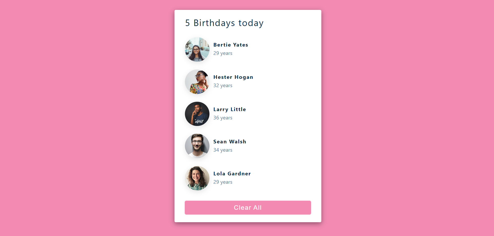

# 🎉 Birthday Reminder App using ReactJS

A simple and beginner-friendly Birthday Reminder App built with **ReactJS**. This project is perfect for those who are just starting out with React and want to get hands-on experience with component-based UI and state management using hooks.

## 🚀 Live Demo

👉 [Live App](https://birthday-reminder-reactjs-app.vercel.app/)

## 🛠️ Tech Stack

- **ReactJS**
- **JavaScript (ES6+)**
- **CSS**

## ✨ Features

- Display list of people with upcoming birthdays
- Option to clear all reminders
- Easy-to-understand component structure
- Clean and minimalistic UI

## 📸 Screenshot

## 📚 Ideal For

- ReactJS Beginners
- Practice for Hooks and useState
- Small project for portfolios
- JavaScript learners looking to build mini tools

## 📫 Contact Me

- **📧 Email:** muhdzaheermv@gmail.com  
- **🔗 Portfolio:** [https://portfolio-lilac-eight-60.vercel.app/](https://portfolio-lilac-eight-60.vercel.app/)  
- **💼 LinkedIn:** [https://www.linkedin.com/in/muhammed-zaheer-836132244/](https://www.linkedin.com/in/muhammed-zaheer-836132244/)

## ⭐ Like This Project?

If you found this useful or learned something new, please consider giving it a **⭐ star** on GitHub — it really helps and keeps me motivated!

